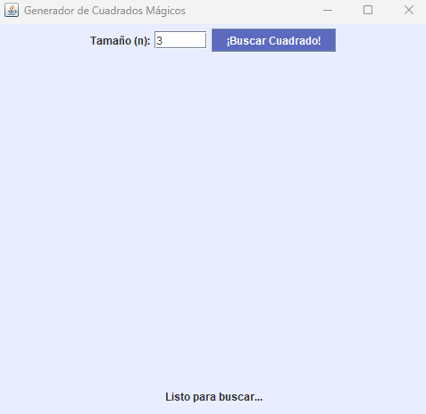
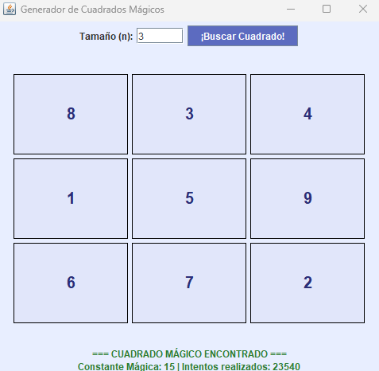
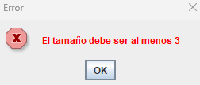

# 🟦 Java Swing: Magic square visualizer

> **Aplicación en Java con interfaz gráfica que busca y muestra Cuadrados Mágicos usando un algoritmo de fuerza bruta.**

---

<br>

<div align="center">
  <table>
    <tr>
      <td align="center"><b>Inicio</b><br></td>
      <td align="center"><b>Solución encontrada</b><br></td>
      <td align="center"><b>Control de errores</b><br></td>
    </tr>
  </table>
</div>

<br>

---

## 📖 Características principales

* **⚡ Concurrencia (Multithreading):** La búsqueda se ejecuta en un `Thread` independiente para evitar que la interfaz se congele durante extensos cálculos.
* **🎨 UI Dinámica:**
    * **Visualización en tiempo real**: Representación gráfica de la matriz con `GridLayout` y componentes `JLabel`.
    * **Respuesta visual**: Indicadores de estado, constante mágica y contador de intentos.
* **🎲 Algoritmo de fuerza bruta:** Mezcla aleatoria de datos en matrices usando `Collections.shuffle` y validación matemática posterior.
* **🛡️ Validación de entradas:** Control de errores para tamaños inválidos o datos no numéricos.

## 📂 Arquitectura del proyecto

El código está todo en un único archivo (`Main.java`) para facilitar la portabilidad, dividiendo internamente las responsabilidades:

| Componente / Método | Responsabilidad                                                                          |
| :--- |:-----------------------------------------------------------------------------------------|
| **`Main (Constructor)`** | **(Vista)** Configura el `JFrame`, paneles y eventos de botones.                         |
| **`iniciarBusqueda()`** | **(Controlador)** Gestiona el hilo secundario (`Thread`).                                |
| **`generarMatrizAleatoria()`** | **(Lógica)** Produce combinaciones numéricas aleatorias sin elementos duplicados.        |
| **`esMagico()`** | **(Validación)** Comprueba si las sumas coinciden (filas, columnas, diagonales).         |
| **`SwingUtilities.invokeLater`** | **(Seguridad)** Coordina la actualización de la interfaz desde el hilo en segundo plano. |

## 🛠️ Stack tecnológico

* **Java JDK 8+**
* **Java Swing:** (javax.swing) - Para la interfaz gráfica.
* **Java AWT:** (java.awt) - Para gestión de layouts y eventos.

## 🚀 Cómo ejecutar el proyecto

1.  **Clonar el repositorio:**
    ```bash
    git clone [https://github.com/CaarlosMrtnz/java-swing-magic-square-visualizer.git](https://github.com/CaarlosMrtnz/java-swing-magic-square-visualizer.git)
    ```
2.  **Entrar en la carpeta:**
    ```bash
    cd java-swing-magic-square-visualizer/src
    ```
3.  **Compilar:**
    ```bash
    javac Main.java
    ```
4.  **Ejecutar:**
    ```bash
    java Main
    ```

## 🧠 ¿Cómo funciona la lógica? 

Sigue la "fuerza bruta", es decir, probar hasta acertar:

1.  Pides un tamaño (por ejemplo, 3).
2.  El programa coge los números del 1 al 9.
3.  Los mezcla como si fuera una baraja de cartas.
4.  Los coloca en la tabla y comprueba si suman lo mismo por todos lados.
5.  Si no funciona, vuelve a mezclar y probar. Así hasta que lo consigue.

> **Nota:** Poner un tamaño de 4 o más puede tardar bastante ya que es aleatorio.

---

*Repo creado como parte de mi aprendizaje en Java. ¡Todo feedback es bienvenido!*
